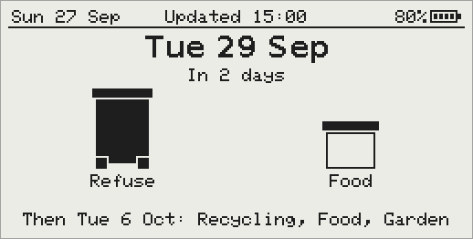
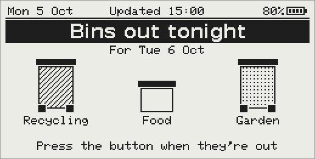
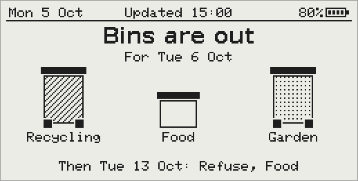
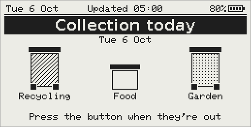
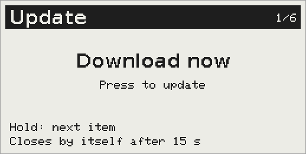

# T5 E-Paper Bin Day

A battery-friendly bin collection reminder for the LilyGO TTGO T5 V2.3 with a 2.13" black and white e-paper screen. It downloads your property's collection calendar from Horsham District Council's website and shows the next collection and which bins go out, with a "Bins out tonight" reminder the day before.

It's the e-paper version of [tdisplay-bin-day](https://github.com/RadioZander/tdisplay-bin-day), which runs on the LilyGO T-Display boards. The calendar download, parsers and setup portal are shared with that project.

## How it works

The board spends nearly all its time in deep sleep. The e-paper keeps showing the picture with no power, so the screen is always readable.

It wakes:

- when it's switched on
- at 05:00, so the screen is up to date before you get up, and at 15:00
- every hour after a failed update, until one works
- at 00:30, to show the new date and day count (not at midnight exactly, as the clock can drift by up to a quarter of an hour between updates)
- when the reminder starts, the day before a collection (see Reminder below)
- when the button is pressed

The 05:00 and 15:00 wakes join WiFi, set the clock (the ESP32's sleep timer drifts by a few percent), download the calendar, redraw the screen if anything changed and go back to sleep. The 00:30 and reminder wakes only redraw, without WiFi, so they cost much less battery. The last good calendar is kept in flash, so the screen stays right through WiFi or website outages.

Battery life hasn't been measured yet. It depends mostly on how much the board draws in deep sleep, which varies between T5 versions.

## What it shows



- **Along the top**: today's date, when the calendar was last downloaded (or "Update failed") in the middle, and the battery charge on the right as a percentage and a four-segment battery, shown white on black when low. The percentage is estimated from the voltage, so treat it as a guide, and it means nothing while on USB power.
- **Headline**: "Bins out tonight" the day before a collection, "Collection today" on the day (both white on black), "Tomorrow" before the reminder starts, otherwise the date of the next collection with the number of days to go underneath
- **Bins**: a picture of each bin being collected, with its name: solid black for refuse, hatched for recycling, a small caddy for food waste and dotted for garden waste
- **Bins are out**: once you've put the bins out, press the button and the headline changes to "Bins are out" until collection day. Press it again to undo
- **Changes**: if the council marks a collection as different from the usual arrangements (for example over Christmas), "(changed)" is added after the date
- **Along the bottom**: a reminder to press the button while the bins need putting out, otherwise the collection after the next one

| The evening before | After pressing the button | On the day |
|---|---|---|
|  |  |  |

These pictures come from the firmware's own drawing code, run on a PC with a made-up calendar (see [Screen pictures](#screen-pictures)).

## Button and menu

The board has one user button (GPIO39), as well as the reset button.

| Action | What it does |
|---|---|
| Short press | Mark the bins as out, the day before or on collection day. Press again to undo |
| Long press (about a second) | Open the menu |

In the menu:

| Action | What it does |
|---|---|
| Long press | Next item. After the last item, closes the menu |
| Short press | Select or change the item |
| No press for 15 seconds | Close the menu |



| Item | What it does |
|---|---|
| Update | Download the calendar now |
| Info | Battery voltage and percentage, last update and its result, next scheduled update, number of collections saved, WiFi network and firmware build date |
| Reminder | When "Bins out tonight" starts the day before a collection: all day, or from any hour between 12:00 and 22:00 |
| Screen | Normal (USB connector at the bottom left) or Flipped (rotated 180 degrees) |
| Preview | Each press shows an example screen: the evening before, then the day of, each of the next two collections |
| Setup | Start the setup portal, to change the WiFi network or address |

Menu screens use a quick partial refresh (under a second, no flashing). Closing the menu and every scheduled update use a full refresh (about 4 seconds), which clears any ghosting.

## Setup

The first time it starts, the device runs a setup portal, much like hotel WiFi:

1. The screen shows a network name like `BinDay-1A2B` and a password. The password changes each time setup starts.
2. Join that network on your phone. The setup page opens by itself, or you can go to `http://192.168.4.1`.
3. Choose your WiFi network and enter its password. The device joins it while your phone stays on the setup network.
4. Enter your postcode, pick your address from the list (or type in a UPRN), and tap **Save and restart**.

Setup also starts from the **Setup** menu item, by holding the button while the screen says "Connecting" at power-on, or by itself if the saved network can't be joined within 2 minutes of power-on. If nobody joins the setup network within 10 minutes, the device restarts and tries the saved network again. While setup is running, hold the button, or tap **Cancel setup** on the page, to restart without changing anything (except during first-time setup, when there's nothing to go back to).

The setup is saved in NVS. To start again from scratch, erase the flash with `idf.py erase-flash` and flash the firmware again.

### Without the portal

For development, `main/secrets.h` can hold your WiFi details and UPRN, which are used whenever nothing has been saved from the portal:

```bash
cp main/secrets.example.h main/secrets.h
```

Then edit `main/secrets.h`. It is git-ignored, so your credentials and UPRN stay out of version control.

## How it gets the calendar

The council's [Personalised Bin Calendar](https://satellite.horsham.gov.uk/environment/refuse/cal_details.asp) has no API, but it's two plain HTML forms: a postcode search (`cal2.asp`) that lists each address with its UPRN, and the calendar itself (`cal_details.asp`), which takes the UPRN. The setup portal does the postcode search once, and after that the device only downloads the calendar. Pages are parsed piece by piece as they download, so only 4 KB of memory is needed.

The device tries HTTPS first, but at the moment that always fails and it falls back to plain HTTP. The council's server only offers TLS 1.2 with RSA key exchange, which Mbed TLS 4 (used by ESP-IDF 6) has removed. Over HTTP your UPRN is sent unencrypted, and the reply could in theory be altered on the way, so the worst case is wrong bin days on the screen. If the council updates their server, the device will start using HTTPS without any changes.

## Getting started

Requires ESP-IDF v6.1.

1. Set up the ESP-IDF environment (this is the `get_idf` alias):
   ```bash
   . ~/esp/esp-idf/export.sh
   ```
2. Set the target. This only needs doing once:
   ```bash
   idf.py set-target esp32
   ```
3. Optionally, change the NTP server or timezone (under **Bin Day Configuration**):
   ```bash
   idf.py menuconfig
   ```
4. Build, flash and watch the log (press Ctrl+] to exit the monitor):
   ```bash
   idf.py flash monitor
   ```
5. Follow the [setup](#setup) steps on the screen.

Most of the time the board is asleep with its serial port quiet. Pressing the button, or the reset button, wakes it and shows the log.

## Testing the parsers

The parsers for the calendar and the postcode search are plain C, so they can be tested on a PC, using the collections table from the council's calendar page (with the address replaced) and made-up addresses:

```bash
cc -Wall -Imain test/test_bin_calendar.c main/bin_calendar.c -lm -o test_bin_calendar && ./test_bin_calendar
```

## Screen pictures

The pictures in this README are drawn by the firmware's own code: `tools/screenshots.c` builds `main.c` on a PC (with stand-ins for ESP-IDF in `tools/host`), draws each screen from a made-up calendar and saves it. To make them again after changing the layout (needs a C compiler and Pillow):

```bash
python tools/screenshots.py
```

## Hardware

LilyGO TTGO T5 V2.3, with an ESP32 (ESP32-D0WDQ6, 4 MB flash) and a CP2104 USB-serial chip. The e-paper panel is labelled HINK-E0213A22 on its ribbon cable: 250×122 pixels, black and white, with an SSD1675B controller. `main/epd.c` is a small driver for it, written from the controller's datasheet, and `main/board.h` has the pins.

| | GPIO |
|---|---|
| E-paper MOSI, SCK | 23, 18 |
| E-paper CS, DC, RST, BUSY | 5, 17, 16, 4 |
| Button | 39 |
| Battery voltage (through a divide-by-two divider, on boards that have one) | 35 |

## Licence and credits

This project is released under the [MIT Licence](LICENSE).

It includes material from other projects under their own licences:

- **DNS server** in `components/dns_server`: from ESP-IDF's captive portal example, Copyright (c) 2021-2025 Espressif Systems, public domain (Unlicense or CC0).
- **5×7 text font** in `main/gfx.c`: from the [Adafruit GFX Library](https://github.com/adafruit/Adafruit-GFX-Library) (`glcdfont.c`), Copyright (c) 2012 Adafruit Industries, BSD licence. The full licence is in [LICENSES/Adafruit-GFX.txt](LICENSES/Adafruit-GFX.txt).
- **Large text font** in `main/font_bold_12.c` and `main/font_bold_20.c`: DejaVu Sans Bold, turned into bitmaps by `tools/make_font.py`. Bitstream Vera Fonts Copyright (c) 2003 Bitstream, Inc., with DejaVu changes in the public domain. The full licence is in [LICENSES/DejaVu.txt](LICENSES/DejaVu.txt).

The built firmware also contains ESP-IDF and the libraries that come with it (such as FreeRTOS, lwIP and Mbed TLS), each under its own licence. If you hand out flashed devices, include the notices listed on Espressif's [Copyrights and Licenses](https://docs.espressif.com/projects/esp-idf/en/latest/esp32/COPYRIGHT.html) page.
